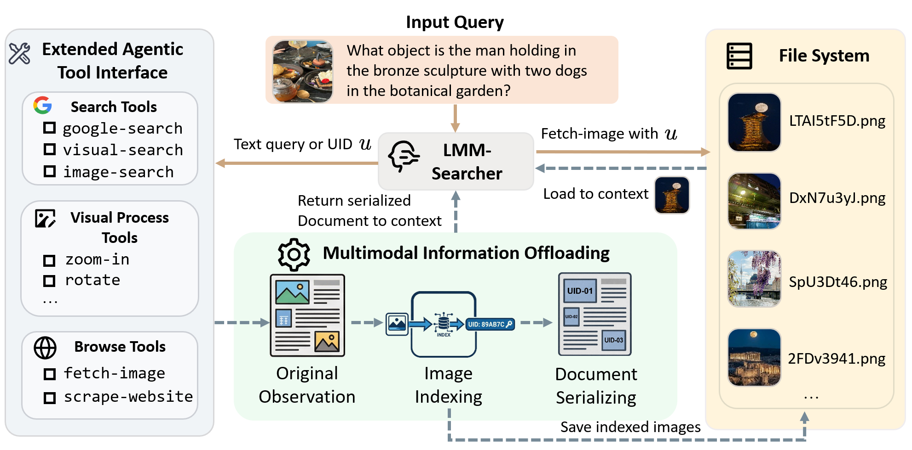
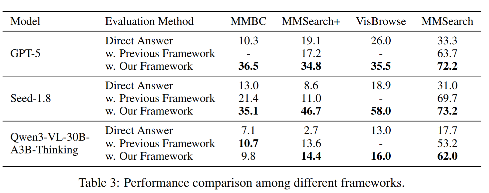

# Towards Long-horizon Agentic Multimodal Search

<p align="center">
  <a href="https://arxiv.org/abs/xxxx.xxxxx"><b>[📜 Paper]</b></a> •
  <a href="https://github.com/RUCAIBox/LMM-Searcher"><b>[🏠 Project Page]</b></a> •
  <a href="https://huggingface.co/datasets/your-repo"><b>[📊 Dataset]</b></a> •
  <a href="https://huggingface.co/your-repo"><b>[🤗 Models]</b></a>
</p>

---

## 📢 News
* **[2026-04-15]** We release the paper and code for **Towards Long-horizon Agentic Multimodal Search**.

## 💡 Overview

While deep search agents have achieved significant success in complex problem-solving, extending them to multimodal domains introduces a critical challenge: the information explosion caused by the high token cost of visual inputs. To fundamentally mitigate the context explosion problem, we propose a scalable multimodal search framework:
* **File-based Multimodal Data Management:** We offload visual assets to an external file system, representing them within the context via lightweight textual identifiers (UIDs).
* **Extended Agentic Tool Interface:** Coupled with a specialized active perception tool, the agent can maintain long-term tracking of accumulated information and progressively load visual content strictly on demand.
* **Long-horizon Data Synthesis:** We develop a comprehensive data synthesis pipeline that distills multi-turn, cross-modal reasoning trajectories from a teacher model to enhance the agent's long-horizon capabilities.

Our method enables scaling up to 100 interaction turns and achieves state-of-the-art performance among open-source models on challenging long-horizon tasks, including MM-BrowseComp and MMSearch-Plus.

<p align="center">
  
</p>

## 🚀 Main Results

We present the main results below.

### Performance on Long-horizon Benchmarks

<p align="center">
  
</p>

<p align="center">
  
</p>

## 🛠️ Getting Started

### 1. Environment Setup

**Prerequisites:** Python 3.12+ and [uv](https://github.com/astral-sh/uv) package manager.

```bash
# Clone the repository
git clone https://github.com/RUCAIBox/LMM-Searcher
cd LMM-Searcher

# Setup environment
cd apps/miroflow-agent
uv sync

# Configure API keys
cp .env.example .env
# Edit .env with your API keys (see Tool Configuration below)
```

### 2. Tool Configuration

The `lmm-searcher` agent uses the following tools:

| Server | Description | Required Environment Variables |
|:-------|:------------|:-------------------------------|
| **`tool-google-search`** | Web search with page scraping and image handling | `SERPER_API_KEY`, `SERPER_BASE_URL` |
| **`jina_scrape_llm_summary`** | Web scraping with LLM-based information extraction | `JINA_API_KEY`, `JINA_BASE_URL`, `SUMMARY_LLM_BASE_URL`, `SUMMARY_LLM_MODEL_NAME`, `SUMMARY_LLM_API_KEY` |
| **`tool-fetch-image`** | Fetch and store images from URLs into local workspace | `OSS_ACCESS_KEY_ID`, `OSS_ACCESS_KEY_SECRET`, `OSS_BUCKET_NAME`, `OSS_ENDPOINT` |
| **`tool-image-processing`** | Image processing (crop) and upload to OSS | `OSS_ACCESS_KEY_ID`, `OSS_ACCESS_KEY_SECRET`, `OSS_BUCKET_NAME`, `OSS_ENDPOINT` |

**`.env` configuration example:**

```bash
# Required for web search
SERPER_API_KEY=your_serper_key
SERPER_BASE_URL="https://google.serper.dev"

# Required for web scraping
JINA_API_KEY=your_jina_key
JINA_BASE_URL="https://r.jina.ai"

# Required for jina_scrape_llm_summary
# Note: Summary LLM can be a small model (e.g., Qwen3-14B or GPT-5-Nano)
SUMMARY_LLM_BASE_URL="https://your_summary_llm_base_url/v1/chat/completions"
SUMMARY_LLM_MODEL_NAME=your_llm_model_name
SUMMARY_LLM_API_KEY=your_llm_api_key

# Required for OSS support (image storage for multimodal tools). We use aliyun in our experiments
OSS_ACCESS_KEY_ID=your_oss_access_key_id
OSS_ACCESS_KEY_SECRET=your_oss_access_key_secret
OSS_BUCKET_NAME=your_bucket_name
OSS_ENDPOINT=your_oss_endpoint 

# Required for benchmark evaluation (LLM-as-a-Judge)
OPENAI_API_KEY=your_openai_key
OPENAI_BASE_URL="https://api.openai.com/v1"
```

> **💡 Note**: All environment variables are listed in `apps/miroflow-agent/.env.example`.


### 3. Run Your First Task

After setting up the environment and starting your server, run `main.py`:

```bash
cd apps/miroflow-agent

# using GPT-5 (requires OPENAI_API_KEY in .env)
uv run python main.py llm=gpt-5 agent=lmm-searcher
```

**To customize your question**, edit `main.py` line 32:

```python
task_description = "Your custom question here"
```

> **💡 Note**: The `lmm-searcher` agent supports multimodal inputs (images). You can provide image paths via the `task_file_name` parameter for visual search tasks.

## Benchmark Evaluation

### Prepare the Data
Prepare your evaluation data following the format in data/MMBC/standardized_data_shuffled_multi_image.jsonl.

### Run the Evaluation
Edit the environment variables in `apps/miroflow-agent/scripts/run_evaluate_multiple_runs_mmbc.sh`.

Run the evaluation script:
```
cd apps/miroflow-agent
bash scripts/run_evaluate_multiple_runs_mmbc.sh
```

## Trace Collection
You can use the following script to collect traces for SFT. It will automatically convert the trace to the sharegpt format required by SFT, and can be directly used in [LLaMA-Factory](https://github.com/hiyouga/LlamaFactory).
```
cd apps/collect-trace
bash scripts/collect_trace_seed18.sh
```

## Citation

```
@misc{du2026longhorizonagenticmultimodalsearch,
      title={Towards Long-horizon Agentic Multimodal Search}, 
      author={Yifan Du and Zikang Liu and Jinbiao Peng and Jie Wu and Junyi Li and Jinyang Li and Wayne Xin Zhao and Ji-Rong Wen},
      year={2026},
      eprint={2604.12890},
      archivePrefix={arXiv},
      primaryClass={cs.CV},
      url={https://arxiv.org/abs/2604.12890}, 
}
```

## Acknowledgments

Our codebase is built upon [MiroThinker](https://github.com/MiroMindAI/MiroThinker). We thank the MiroThinker team for their excellent open-source work.
